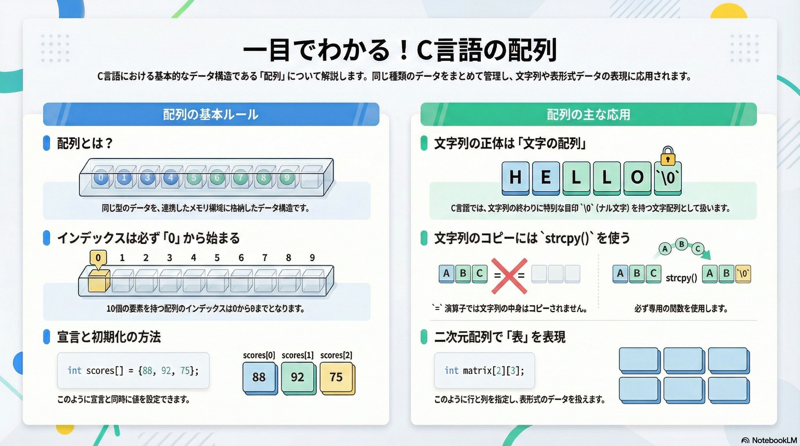

# 配列の基本

## イラスト・ガイダンス



## イントロダクション

C言語の学習も、ここから新たなステージに入ります。この章を終える頃には、あなたは複数のデータを効率的に扱うための「配列（Array）」を完全にマスターし、C言語で最も強力な機能の一つである「ポインタ」の学習に進むための揺るぎない土台を築くことができるようになります(ポインタについては、第2部で学びます)。一つずつ、着実に自分のスキルにしていきましょう。

---------------------------------------------------------------

## 1. 配列の基本概念：なぜ配列が必要なのか？

プログラムを作成する際、扱うデータが数個であれば個別の変数で管理することも可能です。しかし、クラス全員のテストの点数や、一年間の日々の気温など、大量のデータを扱う場面では、一つひとつ変数を宣言するのは現実的ではありません。このような課題を解決し、複数のデータを一つのまとまりとして効率的に管理するために不可欠な仕組みが「配列」です。

### 1.1. 配列とは何か？

配列とは、同じ型のデータを、連続したメモリ領域に並べて格納した集合体のことです。

この構造を身近なものに例えるなら、「同じ大きさの棚が並んだロッカー」を想像してみてください。それぞれの棚には同じ種類のモノ（データ）だけを格納でき、すべての棚は綺麗に一列に並んでいます。このロッカー全体が「配列」であり、一つひとつの棚がデータを格納する「要素」に相当します。


### 1.2. 配列の宣言と値の代入

C言語で配列を使用するには、まず「このようなロッカーを用意します」とコンピュータに伝える「宣言」が必要です。基本構文は以下の通りです。

**データの型 配列の名前[要素の数];**


例えば、10個の整数を格納できる配列を宣言する場合は、次のように記述します。

```
int numbers[10]; // int型のデータを10個格納できるロッカー「numbers」を用意
```

宣言した配列の各要素（棚）に値を代入するには、次のように記述します。

```
numbers[0] = 10; // 1番目の要素に10を代入
```


### 1.3. 配列要素へのアクセスとインデックス

配列内の特定の要素にアクセスするためには、「インデックス（添字）」と呼ばれる番号を使用します。これは、ロッカーの「棚番号」に相当します。

ここで、C言語における最も重要なルールの一つを覚えてください。それは、インデックスは 1 からではなく、必ず 0 から始まる「ゼロベース」であるということです。

したがって、`int numbers[10];` のように10個の要素を持つ配列の場合、利用可能なインデックスは 0 から 9 までの10個となります。numbers[10] というインデックスは存在しないため、アクセスしようとするとエラーの原因となります。このゼロベースのルールは、特にループ処理で配列を扱う際に「オフバイワンエラー」と呼ばれるバグの原因となりやすいため、常に意識することが重要です。

例えば、配列の7番目の要素を取得したい場合、インデックスは 6 を指定します。

```
// 配列の7番目の要素（インデックスは6）を取得して表示する
printf("The 7th number in the array is %d", numbers[6]);
```

### 1.4. 配列の初期化

配列は、宣言と同時にその中身の値を設定する「初期化」を行うことができます。これにより、コードをより簡潔に記述できます。

```
// 宣言と同時に値を設定する
int example[] = {10, 20, 30, 40, 50};
```

このように初期化子 {} を使う場合、[] の中の要素数は省略可能です。コンパイラが値の数から自動的にサイズを判断します。

このインデックスの考え方は配列操作の基本中の基本ですので、ここでしっかり押さえておきましょう。配列の基本的な概念を理解したところで、次はこの配列を応用したC言語特有のデータ表現、すなわち「文字列」の扱いについて見ていきましょう。


---------------------------------------------------------------------------


## 2. C言語における文字列：文字の配列としての探求

多くのプログラミング言語には、テキストデータを扱うための専用の「文字列型」が用意されています。しかし、C言語にはこの「文字列型」というものが存在しません。その代わりに、C言語では文字の配列を用いて文字列を表現するという、言語としての重要な特徴を持っています。

### 2.1. 文字列の正体と終端文字

C言語における文字列の正体は、char 型（1バイトの文字を格納する型）のデータが並んだ配列です。

そして、ただ文字が並んでいるだけではなく、文字列の終わりを示すための特別な目印として「終端文字（ナル文字、\0）」が必ず末尾に格納されています。この \0 は、画面には表示されませんが、「ここで文字列は終わりです」と知らせる非常に重要な役割を担っています。printf のような関数は、この \0 を見つけるまでメモリ上の文字を一つずつ読み進めることで、文字列の終端を判断しています。

### 2.2. 文字列の簡単な初期化方法

文字列（文字配列）を初期化する最も簡単で一般的な方法は、ダブルクォーテーション "" を使うことです。

```
char greeting[] = "Hello";
```

この方法の最大の利点は、コンパイラが自動的に終端文字 `\0` を末尾に追加してくれる点にあります。上記の例では、配列 greeting には H, e, l, l, o の5文字に加えて、最後に `\0` が格納され、合計6個の要素を持つ配列が生成されます。この自動的な処理のおかげで、私たちは終端文字を意識することなく、直感的に文字列を扱うことができます。

文字列が文字の配列であることを理解できたでしょうか。次に、これらの文字列をコピーしたり、連結したりするための、C言語が提供する標準的なツールセットについて学んでいきましょう。


---------------------------------------------------------------

## 3. 文字列操作の標準テクニック：string.hライブラリ

文字列の長さを調べたり、内容をコピーしたりといった操作は、プログラミングにおいて頻繁に発生します。これらの基本的な処理を毎回自分で実装するのは非効率であり、バグの原因にもなりかねません。そこでC言語は、安全で効率的な文字列操作を可能にするための便利な関数群を、標準ライブラリ string.h として提供しています。

3.1. 主要な文字列操作関数

string.h に含まれる関数を使用するには、プログラムの冒頭で `#include <string.h>` と記述する必要があります。以下に、特によく使われる4つの主要な関数を紹介します。

|関数名|機能|具体例（イメージ）|
|---|---|---|
|strlen()|文字列の長さを調べる（\0は数えない）|"Apple" なら 5 を返す|
|strcpy()|宛先の配列へ、元の文字列の内容を上書きコピーする。（注意：宛先配列のサイズが不足しているとメモリ破壊を引き起こす）|ある文字列を別の配列にそっくり移す。|
|strcat()|元の文字列の末尾に、二つ目の文字列を連結する。（注意：連結後の文字列を格納できる十分なサイズが宛先配列に必要）|二つの文字列を繋げて一つにする。|
|strcmp()|文字列の比較を行う。同一なら 0 を返し、異なる場合は 0 以外の値を返すため、if文の条件分岐でよく使われる。|二つの文字列が同じかどうかを調べる。|

これらの関数を使いこなすことで、文字列の操作を安全かつ簡潔に実装できます。

### 3.2. C言語における文字列コピーの注意点

Pythonのような他の言語に慣れている方が陥りやすい間違いとして、代入演算子 = を使った文字列のコピーが挙げられます。C言語では、`string1 = string2` のような単純な代入演算子では、文字列の中身がコピーされません。

この挙動の理由は、C言語の変数が「値」そのものではなく「値が格納された場所」を指し示すポインタとして扱われる場合があるためです。詳細はポインタの章で明らかになりますが、現時点では「文字列コピーには strcpy() を使う」と覚えてください。

ここまでで、一次元の配列とその応用である文字列について学びました。次に、データをさらに立体的に扱うことができる、多次元配列の世界へと進んでいきましょう。


---------------------------------------------------------------

## 4. 多次元配列：行と列を持つデータの管理

これまで見てきた一次元配列が単なるデータの「リスト」であったのに対し、多次元配列、特に二次元配列は、スプレッドシートのような「表」や数学の「行列」といった、より複雑な構造を持つデータをプログラム内で直感的に表現することを可能にします。これにより、例えば座席表やゲームのマップといったデータを簡単に管理できるようになります。

### 4.1. 二次元配列の概念と宣言

二次元配列は、「一次元配列のリスト」あるいは「行と列を持つ表」として考えることができます。宣言するための基本構文は以下の通りです。

```
type arrayName[x][y];
```

ここで **[x] は行数（タテの数）、[y] は 列数（ヨコの数）** に対応します。例えば、3行4列の整数型二次元配列は次のように宣言します。

```
int matrix[3][4]; // 3行4列の整数型二次元配列
```

### 4.2. 二次元配列の初期化

二次元配列も、宣言と同時に初期化することができます。各行を波括弧 {} で囲むことで、表の構造を視覚的に分かりやすく表現できます。

```
int a[3][4] = {
  {0, 1, 2, 3},   // 1行目 (インデックス 0)
  {4, 5, 6, 7},   // 2行目 (インデックス 1)
  {8, 9, 10, 11}  // 3行目 (インデックス 2)
};
```

また、内側の波括弧は省略して、一次元配列のように記述することも可能です。

```
int a[3][4] = {0,1,2,3,4,5,6,7,8,9,10,11};
```

ここで一つ、非常に重要なルールがあります。初期化時に行数 [x] は省略できる場合がありますが（例: char vowels[][5]）、列数 [y] は絶対に省略できません。これにより、コンパイラは a[i][j] のような要素がメモリ上のどの位置にあるかを (i * 列数 + j) という計算式で特定できるのです。

### 4.3. 二次元配列の要素へのアクセス

二次元配列の特定の要素にアクセスするには、行と列の2つのインデックス a[i][j] を使用します。i が行インデックス、j が列インデックスです。

例えば、配列 a の「3行目の4番目の要素」（値は 11）にアクセスしたい場合、インデックスはゼロから始まるため、次のように記述します。

```
int val = a[2][3]; // 3行目 (インデックス2) の 4番目 (インデックス3) の要素を取得
```

配列の基本から応用までを学んできましたが、これらの知識はすべて、C言語の核心へと繋がっています。最後に、本章のまとめと、次のステップについてお話しします。


---------------------------------------------------------------

## 5. まとめと次のステップ：ポインタへの架け橋

この章では、C言語における配列の概念を多角的に学んできました。ここで、核心となるコンセプトを振り返りましょう。

* 基本機能: 配列は、同じ型のデータをメモリ上に連続して配置し、インデックスを使って効率的に管理するための基本的なデータ構造です。
* 文字列の表現: C言語には文字列型がなく、代わりに終端文字 \0 を持つ char 型の配列として文字列を扱います。
* 多次元配列: 二次元配列を使うことで、リスト構造を超えた「行」と「列」を持つ表形式のデータを直感的に扱うことができます。

これらの配列に関する深い理解は、C言語の学習における最大の山場であり、最も強力な概念である「ポインタ」を習得するための絶対的な土台となります。

ポインタとは、データの「値」そのものではなく、そのデータがメモリ上のどこに格納されているかという「場所（住所）」を直接扱うための仕組みです。そして、配列の名前自体が、実はポインタと密接な関係にあることを知ったとき、C言語の全体像がより鮮明に見えてくるはずです。

ポインタの詳細は第2部で学ぶことになります。そのとき、本章で得た配列の知識が、ポインタの世界へ挑戦する、とても重要な足掛かりになるでしょう。
