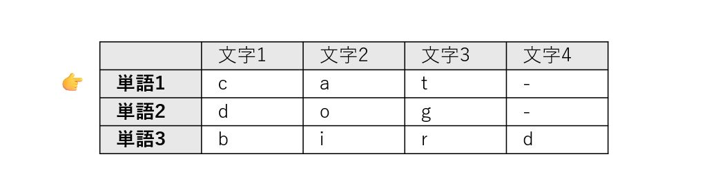
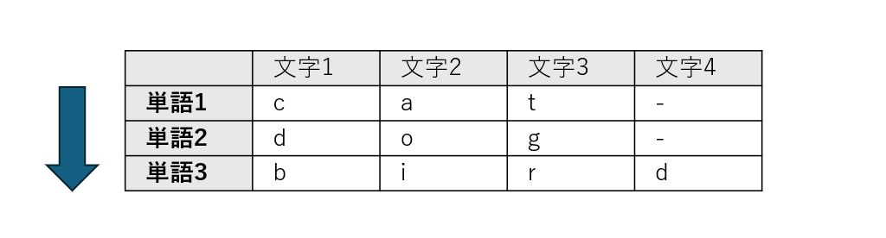
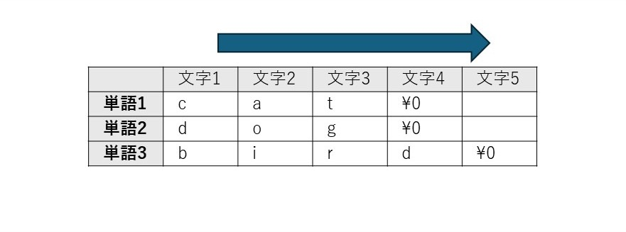
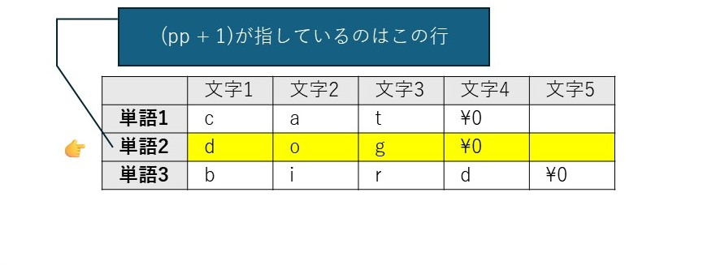
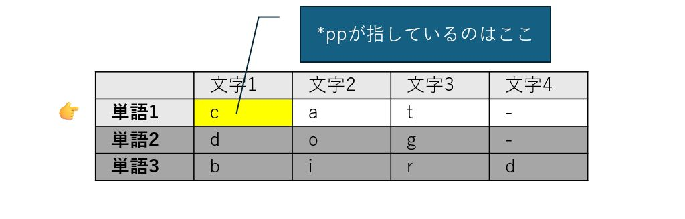
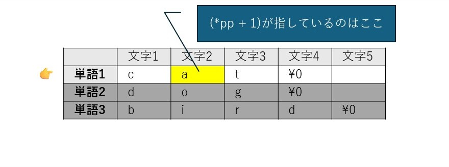

# ポインタのポインタ


## イントロダクション：なぜポインタはC言語の「最初の壁」であり「最強の武器」なのか

本章は、C言語学習における最大の難関の一つである「ポインタのポインタ(`char **`)」の概念を体系的に解き明かすことを目的としています。多くの初学者にとって、ポインタは抽象的で理解が難しい「最初の壁」として立ちはだかります。それが「ポインタのポインタ」となると、より難解に見えるでしょう。しかし、その壁を乗り越え、マスターすれば、メモリを直接操作できるというC言語の強力な機能を最大限に引き出す「最強の武器」を手に入れることができます。

このガイドを通じて、みなさんは以下の2つのステップで、ポインタの本質的な理解を深めていきます。

1. ポインタのポインタの直感的なモデル： 最も難解な char ** を「縦横の移動」というシンプルなモデルで攻略します。
2. 実践的なコードでの応用： 抽象的なモデルが、実際のプログラムでどのように機能するかを体験します。

ここで重要なのは、二次元配列、すなわち「配列の配列」がエクセルの1シートのような表のイメージで理解できるのと同様、**ポインタのポインタも縦横に移動できる表のイメージで、直感的に理解できる** 点です。

それでは解説を始めましょう。

## 1. 最重要概念：char **pp（ポインタのポインタ）の完全攻略

`char **pp`（ポインタのポインタ）は、C言語初学者が直面する最大の難関の一つです。これは、ポインタが指す先が「値」ではなく「別のポインタ」であるため、概念の階層が一つ増え、混乱を招きやすいためです。

前の章で、`array + 1` が「要素のサイズ」分だけ移動することを確立しましたね。では、その「要素」自体がポインタだったらどうなるでしょうか？ これこそが `char **pp` の謎を解く鍵です。この難関を乗り越えるため、ここでは専門的なメモリの話を一旦脇に置き、直感的な思考モデルを導入します。

直感的な思考モデル：「単語帳」と「現在地を指す指」

`char **pp` を理解するために、以下のような「単語のリスト（単語帳）」を想像してください。

* cat
* dog
* bird

`char **pp` とは、このリストの **「現在地」を指しているあなたの「指」** だと考えます。最初は一番上の "cat" を指しています。



このモデルを使うと、複雑なポインタ演算は2つのシンプルな動きに集約できます。

ズバリ一言で言うと

* `(pp + 1)` は、 「次の単語へ」進む（縦の移動）

* `(*pp + 1)` は、 「今の単語の次の文字へ」進む（横の移動）


**図解：縦移動と横移動**

この「縦」と「横」の動きの違いを視覚的に整理しましょう。pp が指しているのは、「単語の先頭」です。

**1. `(pp + 1)` の分析：縦の移動**


* 操作: pp + 1 は、「指」そのものを1つ進める操作です。
* 結果: "cat" という単語全体をスキップし、指は次の単語 "dog" の先頭を指すようになります。
* 結論: これは、単語帳を縦に1行下りる動きです。



**2. `(*pp + 1)` の分析：横の移動**



* 操作: *pp でまず「指が指している先の中身」、つまり "cat" という単語そのものを取り出します。その結果に対して +1 をします。
* 結果: "cat" という単語の中で、先頭の 'c' から隣の 'a' に移動します。
* 結論: これは、今見ている単語の中で横に1文字ズレる動きです。



**なぜそうなるのか？：データ型の観点から**

この「縦横モデル」は、データ型に基づいた厳密なルールに裏付けられています。

* ppの正体： pp は char ** 型、つまり char * 型（文字列のアドレス）を指すポインタです。したがって、pp + 1 は sizeof(char *) 分だけアドレスを進め、次の「文字列のアドレス」を指します。これが「次の単語」への移動（縦移動）の正体です。
* *ppの正体： *pp は pp が指すアドレスの中身を取り出す操作です。その結果は char * 型、つまり "cat" という文字列の先頭アドレスそのものです。これに +1 すると、sizeof(char) (1バイト) 分だけアドレスが進むため、'c' の隣の 'a' を指します。これが「次の文字」への移動（横移動）の正体です。

この「縦横モデル」が、コマンドライン引数の処理など、実際のプログラムでどのように機能するかを次のセクションで見ていきましょう。

## 2. 実践：コードで理解する「縦移動」と「横移動」

前セクションで学んだ抽象的な「縦横モデル」が、単なる比喩ではなく、C言語の動作そのものであることを具体的なコードを通じて体験しましょう。理論を実践に結びつけることで、理解はより確かなものになります。

#### 実践例1：コマンドライン引数の表示 (args_test.c)

このプログラムは、実行時に渡されたコマンドライン引数を一つずつ順番に表示します。C言語の main 関数が受け取る char **argv（または char *argv[]）は、まさにこの「単語帳」モデルの典型例です。

**args_test.c**

```
#include <stdio.h>

int main(int argc, char **argv) {
    printf("引数の数 (argc): %d\n", argc);

    // ポインタのポインタ argv を使って、各引数を表示
    // argv[i] は *(argv + i) と等価
    for (int i = 0; i < argc; i++) {
        printf("%d番目の引数: %s\n", i, *(argv + i));
    }

    return 0;
}
```

**コンパイルと実行**

> cl args_test.c
> ./args_test.exe apple banana


**実行結果と解説**

引数の数 (argc): 3
0番目の引数: ./args_test.exe
1番目の引数: apple
2番目の引数: banana


この結果は、`*(argv + i)` というポインタ演算が、まさに **「縦の移動」** であることを示しています。

* *(argv + 0) は、0番目の引数を指します。ここで面白いのは、実はプログラム名そのものが「0番目の単語」としてリストに入っているという点です。これは初学者がよく見落とすポイントです。
* *(argv + 1) は、リストを縦に1つ進み、1番目の引数 "apple" を指します。
* *(argv + 2) は、さらに縦に進み、2番目の引数 "banana" を指します。

**おまけ：** 横移動の確認 もし、printf 文を

```
 printf("%d番目の引数: %s\n", i, *(argv + i) + 1);
```

  と書き換えて実行すると、1番目の引数の出力は "pple" となります。これは、*(argv + 1) で単語 "apple" を特定した後に +1 することで、先頭文字 'a' から1つ**「横の移動」**が起こり、2文字目の 'p' から表示が始まったことを実証しています。

#### 実践例2：特定の文字をスキップ (remove_hyphen.c)

このプログラムは、外側のループで「縦移動（次の引数へ）」を行い、内側のループで「横移動（文字の走査）」を行って、ハイフン - を含まない文字だけを表示します。

**remove_hyphen.c**

```
#include <stdio.h>

int main(int argc, char **argv) {
    // 縦移動: 1番目から最後の引数までループ (0番目はプログラム名なのでスキップ)
    for (int i = 1; i < argc; i++) {
        char *current_char_ptr = argv[i]; // 現在の引数（単語）の先頭アドレスを取得

        // 横移動: 文字列の終端 '\0' まで1文字ずつ走査
        while (*current_char_ptr != '\0') {
            if (*current_char_ptr != '-') {
                putchar(*current_char_ptr);
            }
            current_char_ptr++; // 次の文字へポインタを進める
        }
        putchar(' '); // 単語の区切りにスペースを挿入
    }
    putchar('\n');
    return 0;
}
```

横移動の核となる `current_char_ptr++` このプログラムの「横移動」は、`current_char_ptr++` という一行が担っています。

1. char *current_char_ptr = argv[i]; で、現在の単語の先頭アドレスを取得します。
2. while ループの中で current_char_ptr++ が実行されるたびに、ポインタは sizeof(char) (1バイト) 分だけアドレスを進めます。
3. これにより、ポインタは文字列の中を1文字ずつ正確に移動し、終端のヌル文字 \0 に到達するまで走査を続けます。これは、(*pp + 1) の概念と完全に一致する具体的な動作です。

これらの実践的なコード例を通して、`char **` を用いたポインタ演算が、単なる理論ではなく、実用的なプログラムを構築するための強力なツールであることがお分かりいただけたでしょう。

## 3. よくある混乱：char a[] (配列) と char *a (ポインタ) の決定的違い

文字列を扱う際、`char a[] = "Hello";` という配列宣言と `char *a = "Hello";` というポインタ宣言は、一見よく似ていますが、メモリ上での振る舞いは全く異なります。この違いを正確に理解することは、予期せぬバグやセグメンテーション違反といった深刻なエラーを防ぐ上で極めて重要です。

**`char a[];` の正体：書き換え可能な「箱」の確保**

`char a[4];` のように配列を宣言すると、その瞬間に文字を入れるための「箱」が物理的にメモリ上に確保されます。この領域はプログラムの実行中に自由に変更が可能です。

```
char a[] = "cat"; // {'c', 'a', 't', '\0'} の4バイトの箱が確保される
a[0] = 'b';       // OK! 中身は "bat" になる
```

ただし、重要な制約があります。配列名 a は、確保された箱の先頭アドレスを指す**「定数」**として扱われます。そのため、a が別の場所を指すように変更することはできません。

**`char *a;` の正体：住所を記録するための「メモ」**

一方、char *a; のようにポインタを宣言した場合、確保されるのはアドレスを記録するための「メモ」用の変数 a のみです。文字そのものを格納する「箱」は、この時点ではまだ用意されていません。したがって、有効なアドレスを代入せずに使用しようとすると、未定義の動作を引き起こします。

最も注意が必要なパターン：読み取り専用領域の罠

ポインタで最もよく使われ、同時に最も注意が必要なのが、文字列リテラルによる初期化です。

```
char *a = "Hello"; // "Hello"は読み取り専用領域に配置される
```

この場合、"Hello" という文字列は、プログラムが始まる前に用意された読み取り専用領域に配置されます。ポインタ変数 a は、その場所のアドレスを指すだけです。これを「博物館のガラスケース」に例えることができます。中身を見ることはできますが、変更しようとすると警報が鳴ります。

`a[0] = 'B'; // NG!` ガラスケースを割ろうとする行為。セグメンテーション違反でクラッシュする可能性が高い。


これはC言語初心者が最も陥りやすいクラッシュの原因の一つです。この違いを脳に焼き付けることが、何時間ものデバッグ作業を節約することに繋がります。

では、なぜこのような仕組みになっているのでしょうか？ この読み取り専用の保護は、実は極めて重要なセキュリティ機能です。これにより、プログラムが誤って、あるいは悪意を持って自分自身の命令コードや定数データを書き換えてしまうのを防ぎ、より安定した安全なシステムを実現しているのです。

**まとめ：配列とポインタの使い分け**

両者の違いを明確に理解し、適切に使い分けることが重要です。

|項目|char a[]; （配列）|char *a; （ポインタ）|
|---|---|---|
|メモリの確保|文字を入れる箱が確保される|住所をメモする場所だけ確保される|
|箱の中身の変更|安全に書き換え可能|原則NG （特にリテラル代入時）|
|住所の変更|NG （常に同じ場所を指す定数）|OK （別の文字列の住所に切り替え可能）|

明確な指針は以下の通りです。

* 後から内容を書き換えたい場合： 配列 char a[] を使用する。
* 別の文字列を指すように切り替えたい、または書き換え不要な固定文字列を使いたい場合： ポインタ char *a を使用する。

## 4. 応用：動的メモリ確保とポインタ

コンパイル時にサイズが決定される配列には、「実行時まで必要なサイズがわからない」という状況に対応できない限界があります。この問題を解決するのが、プログラム実行中に必要な分だけメモリを確保する動的メモリ確保であり、ポインタはこの技術の根幹をなす要素です。

**malloc による1次元配列の確保**

malloc 関数を使うと、指定したサイズのメモリブロックをヒープ領域から確保し、その先頭アドレスを返すことができます。このアドレスをポインタ変数に格納することで、確保した領域を配列のように利用できます。

```
#include <stdlib.h> // malloc, free を使うために必要
#include <stdio.h>

int main() {
    int n = 5;
    // char型5個分のメモリを動的に確保
    char *pvowels = (char *)malloc(n * sizeof(char));

    if (pvowels == NULL) { return 1; } // メモリ確保失敗時のエラー処理

    pvowels[0] = 'A';
    *(pvowels + 1) = 'E'; // ポインタ演算でもアクセス可能
    pvowels[2] = 'I';
    pvowels[3] = 'O';
    pvowels[4] = 'U';

    for (int i = 0; i < n; i++) {
        printf("%c ", pvowels[i]);
    }
    printf("\n");

    // 使い終わったメモリは必ず解放する
    free(pvowels);

    return 0;
}
```

動的メモリ確保の最大の利点は、必要な分だけメモリを確保できる柔軟性にありますが、同時に**free() を呼び出してメモリを解放する責任**がプログラマに生じます。これを怠ると、プログラムが確保したメモリを返却しない「メモリリーク」が発生し、システム全体のパフォーマンスを低下させる原因となります。

**`char **` を用いた2次元配列の動的確保**

ポインタのポインタは、2次元配列を動的に確保する際に真価を発揮します。ここで、セクション2で学んだ「縦横モデル」が具体的にどう使われるか見てみましょう。これは2段階のプロセスで行われます。

1. 縦のリストを確保： まず、「行」の数だけ char * (ポインタ) を格納するための領域を確保します。これが「単語帳」の構造そのもの、つまり縦のリストを作る作業です。
2. 横の領域を確保： 次に、各行のポインタに対してループ処理を行い、それぞれに「列」の数だけ char を格納するための領域を確保します。これが各単語の文字を格納する横のスペースを作る作業です。

この2段階プロセスが、抽象的なモデルと具体的なメモリ確保を結びつける「アハ体験」の瞬間です。

```
#include <stdio.h>
#include <stdlib.h>

int main() {
    int nrows = 2;
    int ncols = 5;
    int i, j;

    // 1. 行ポインタの領域を確保 (char* を nrows 個分) -> 「縦」の確保
    char **pvowels = (char **)malloc(nrows * sizeof(char *));

    // 2. 各行の領域を確保 (char を ncols 個分) -> 「横」の確保
    for (i = 0; i < nrows; i++) {
        pvowels[i] = (char *)malloc(ncols * sizeof(char));
    }

    // データ代入
    pvowels[0][0] = 'A';
    pvowels[0][1] = 'E';
    pvowels[0][2] = 'I';
    pvowels[0][3] = 'O';
    pvowels[0][4] = 'U';

    pvowels[1][0] = 'a';
    pvowels[1][1] = 'e';
    pvowels[1][2] = 'i';
    pvowels[1][3] = 'o';
    pvowels[1][4] = 'u';

    // データ表示
    for (i = 0; i < nrows; i++) {
        for(j = 0; j < ncols; j++) {
            printf("%c ", pvowels[i][j]);
        }
        printf("\n");
    }

    // 解放も2段階で行う
    // 最初に各行を解放
    for (i = 0; i < nrows; i++) {
        free(pvowels[i]);
    }
    // 最後にトップレベルのポインタを解放
    free(pvowels);
    
    return 0;
}
```

メモリ解放も確保とは逆の順序で、各行（横）を解放してから、トップレベルのポインタ（縦）を解放する必要があります。

## 5. まとめ：ポインタを使いこなすための重要ポイント

本研修資料を通じて、C言語のポインタ、特にその核心である char ** について学んできました。最後に、ポインタを安全かつ効果的に使いこなすための最重要ポイントを3つに絞って振り返ります。

* 配列とポインタの等価性 配列記法 a[i] は、ポインタ演算 *(a + i) の可読性を高めた表現です。この表裏一体の関係性を理解することが、C言語がメモリをどのように扱っているかを解き明かす鍵となります。
* ポインタのポインタの「縦横モデル」 char **pp のような複雑な構造は、pp+1 が「次の単語（行）」への縦移動、*pp+1 が「現在の単語内の次の文字（列）」への横移動という直感的なモデルで捉えることで、格段に理解しやすくなります。
* 宣言による役割の違い char a[] は書き換え可能なデータ格納用の**「箱」を確保し、char *a はアドレスを指すための「メモ」**を確保します。特に文字列リテラルをポインタに代入する際は、読み取り専用領域へのポインタとなるため、内容の変更は厳禁です。この違いを常に意識することが、安全なプログラミングに不可欠です。

ポインタの学習は一度で完結するものではありません。本当の習熟は、実際にコードを書き、コンパイルし、そしてデバッガを使ってメモリ上のアドレスや値がどのように変化するかを自分の目で追いながら試行錯誤を繰り返すことで達成されます。本資料が、皆様のその一歩を踏み出すための確かな土台となることを願っています。
