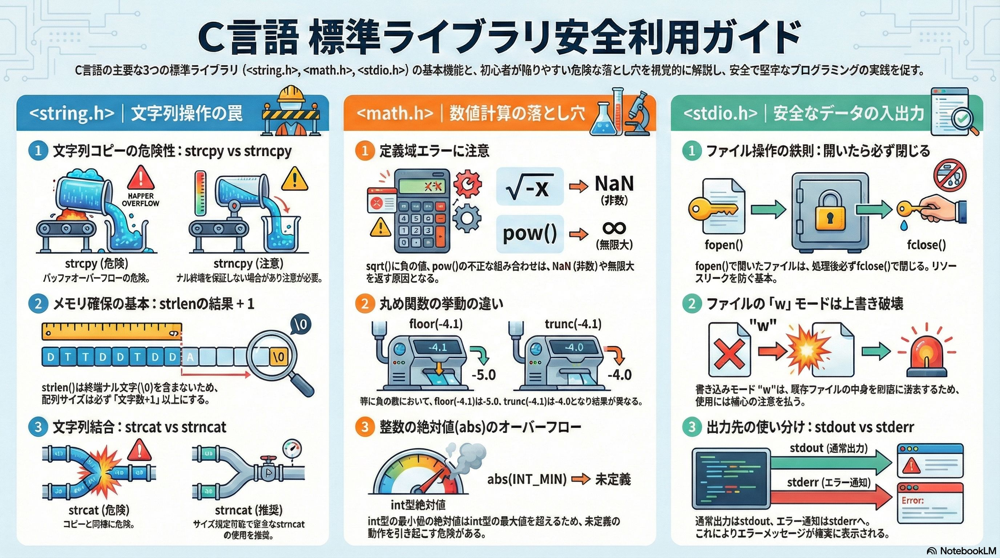

# 標準ライブラリ関数

## 1. はじめに：標準ライブラリの重要性

本章の目的は、皆さんがC言語プログラミングの世界で確かな一歩を踏み出すために不可欠な「標準ライブラリ関数」の知識と実践的な使い方を習得することです。C言語における標準ライブラリは、複雑な処理を簡潔に記述するための強力なツールキットであり、いわば熟練した職人が用意してくれた高精度な道具箱のようなものです。これらの道具を正しく使いこなすことは、効率的で信頼性の高いソフトウェアを開発するための鍵であり、特にC言語特有の落とし穴を予測し回避する**「ディフェンシブ・プログラミング」**を実践するための第一歩となります。

本章では、C言語プログラミングで最も頻繁に使用される以下の3つの主要なヘッダファイルに焦点を当てて解説します。

* <string.h>: 文字列のコピー、比較、結合といった基本的な文字列操作を担当します。
* <math.h>: 累乗や平方根、丸め処理など、科学技術計算に不可欠な数値計算機能を提供します。
* <stdio.h>: コンソールやファイルとのデータのやり取り、すなわち入出力処理の基盤を担います。

これらのライブラリを理解することは、C言語プログラミングの基礎を固める上で避けては通れない道です。それではまず、以前の章で学んだことと重複しますが、改めてプログラムの根幹をなすデータの一つである「文字列」を安全かつ効率的に扱うための技術から見ていきましょう。

--------------------------------------------------------------------------------

## 2. 文字列操作の基本: <string.h> ライブラリ

C言語には、他の多くのプログラミング言語にあるようなネイティブな「文字列型」は存在しません。その代わりに、文字の配列（char型配列）の終端に特別な文字であるナル文字（\0）を置くことで文字列を表現します。この仕様のため、文字列操作には細心の注意が必要となります。<string.h>ライブラリは、こうした文字配列を安全かつ効率的に操作するための一連の標準関数を提供し、C言語における文字列処理の基盤を形成しています。これらの関数を正しく理解し、使いこなすことは、バグの少ない堅牢なコードを書くための第一歩です。

### 2.1 文字列のコピー (strcpy, strncpy)

文字列のコピーは最も基本的な操作の一つですが、同時に最も危険を伴う操作でもあります。strcpyとstrncpyの違いを正確に理解することが重要です。

|関数名|目的|説明|注意点|
|---|---|---|---|
|strcpy(s1, s2)|文字列をコピーする|文字列 s2 の内容を、文字列 s1 へと完全にコピーします。|s1 は、s2 の文字列全体と終端のナル文字 (\0) を格納できるだけの十分な大きさの配列である必要があります。さもないと、バッファオーバーフロー（メモリの破壊）を引き起こす致命的な危険性があります。|
|strncpy(s1, s2, n)|指定した長さだけ文字列をコピーする|文字列 s2 の内容から、最大で n 文字だけを s1 へコピーします。|s2 の長さが n 文字以上の場合、s1 には終端のナル文字 ('\0') が自動的に付加されないため、手動で追加する必要があります。逆に s2 の長さが n 文字未満の場合、s1 の残りの部分はナル文字で埋められます。|

strcpyはシンプルですが、コピー先のバッファサイズを一切考慮しないため、非常に危険です。例えば、10バイトの配列に20バイトの文字列をコピーしようとすると、配列の境界を越えてメモリが破壊され、プログラムのクラッシュや予測不能な脆弱性の原因となります。

一方、strncpyはコピーする最大文字数を指定できるため、一見すると安全な代替策に見えます。しかし、コピー元の文字列長が指定文字数n以上の場合、コピー先の文字列がナル終端されないという重大な注意点があります。安全にstrncpyを使用するためには、常に手動でナル文字を書き込む習慣をつけるべきです。

### 2.2 文字列の比較 (strcmp, strncmp)

文字列が等しいかどうか、あるいは辞書順でどちらが先に来るかを判定するために比較関数を使用します。

|関数名|目的|説明|戻り値|
|---|---|---|---|
|strcmp(s1, s2)|2つの文字列を比較する|文字列 s1 と s2 を、先頭から終端のナル文字まで完全に比較します。|等しい (s1 と s2 が同じ文字列) なら 0。  s1 の方が大きい (辞書順で後) なら 正の数。  s1 の方が小さい (辞書順で前) なら 負の数。|
|strncmp(s1, s2, n)|指定した長さだけ2つの文字列を比較する|文字列 s1 と s2 の、先頭から最大で n 文字だけを比較します。|等しい (最初の n 文字が同じ) なら 0。  s1 の方が大きい なら 正の数。  s1 の方が小さい なら 負の数。|

strcmpの戻り値は、単に true/false ではなく、2つの文字列の辞書順での大小関係を示します。s1がs2より辞書順で後にある場合（例: strcmp("banana", "apple")）は正の数を、その逆の場合は負の数を返します。この特性は、文字列のソート処理などで非常に役立ちます。

### 2.3 文字列の結合 (strcat, strncat)

既存の文字列の末尾に別の文字列を追加（結合）する操作です。コピーと同様にバッファオーバーフローのリスクが伴います。

|関数名|目的|説明|注意点|
|---|---|---|---|
|strcat(s1, s2)|文字列を結合する|文字列 s2 を、文字列 s1 の末尾に結合します。結果は s1 に格納されます。|s1 は、結合後の s1 と s2 の両方の文字列全体と終端のナル文字を格納できるだけの十分な大きさの配列である必要があります。バッファオーバーフローのリスクが非常に高いです。|
|strncat(s1, s2, n)|指定した長さだけ文字列を結合する|文字列 s2 の内容から、最大で n 文字だけを s1 の末尾に結合します。|常に結合後の文字列の末尾に終端のナル文字 (\0) が付加されます。この点で strncpy よりも安全ですが、s1 の配列サイズが結合後の文字列長を格納するのに十分であることの確認は依然として必要です。|

strcatはstrcpyと同様に、結合先のバッファサイズを考慮しないため、深刻なバッファオーバーフローを引き起こす可能性があります。安全性を考慮するなら、結合する最大文字数を指定でき、かつ常にナル終端を保証してくれるstrncatの使用が推奨されます。

### 2.4 文字列の長さ (strlen)

文字列の長さを取得する、非常に基本的ながら重要な関数です。

|関数名|目的|説明|戻り値|
|---|---|---|---|
|strlen(s)|文字列の長さを取得する|文字列 s に含まれる文字の数を数えます。|終端のナル文字 (\0) を除く、文字の総数を返します。|

初心者が最も間違いやすいポイントは、strlenが返す値に終端のナル文字(\0)は含まれないという点です。例えば、"Hello" という文字列の長さは5です。しかし、この文字列を格納するために必要な配列のサイズは、ナル文字を含めた6バイト（char buffer[6];）であることに注意してください。この1バイトの違いを意識することが、バッファオーバーフローを防ぐ上で極めて重要です。

文字列操作の基本をマスターしたところで、次はプログラムに計算能力を与える数学関数の世界を探求していきましょう。

--------------------------------------------------------------------------------

## 3. 数値計算と数学関数: <math.h> ライブラリ

<math.h>ライブラリは、C言語におけるあらゆる数値処理の根幹をなす関数群を提供します。単純な四則演算を超えた、科学技術計算、グラフィックス、データ分析など、高度なアプリケーション開発には欠かせない存在です。これらの関数の多くは、計算精度を確保するためにdouble型の浮動小数点数を引数とし、double型を戻り値として返します。これらの関数を利用するには、プログラムの先頭で #include <math.h> を記述する必要があります。

### 3.1 累乗・平方根関数

べき乗や平方根など、基本的な代数計算を行うための関数です。

|関数名|宣言|説明|例（概念）|
|---|---|---|---|
|pow(base, exp)|double pow(double, double)|base の exp 乗、つまり base^{exp} を計算します。|pow(2.0, 3.0) は 2^3=8.0 を返します。|
|sqrt(x)|double sqrt(double)|x の正の平方根（二乗根）を計算します。\sqrt{x} と等価です。|sqrt(9.0) は \sqrt{9}=3.0 を返します。|
|cbrt(x)|double cbrt(double)|x の立方根（三乗根）を計算します。\sqrt[3]{x} と等価です。|cbrt(27.0) は \sqrt[3]{27}=3.0 を返します。|
|hypot(x, y)|double hypot(double, double)|x と y を直交する2辺とする直角三角形の斜辺の長さを計算します。\sqrt{x^2 + y^2} と等価です。|hypot(3.0, 4.0) は \sqrt{3^2+4^2}=5.0 を返します。|

**特に重要な注意点**

* pow(base, exp):
  * baseが負の数で、expが整数でない場合（例: pow(-2.0, 0.5)）、数学的に結果は複素数となるため、C言語ではドメインエラーとなり、NaN（Not a Number）などが返されます。
  * baseが 0 で、expが負の数の場合（例: pow(0.0, -1.0)）、ゼロ除算が発生するため、結果は無限大（Inf）となります。
* sqrt(x):
  * xに負数を渡した場合、実数の範囲では解が存在しないため、ドメインエラーとなります。

### 3.2 丸め関数

浮動小数点数を、指定されたルールに従って整数値に丸めるための関数です。戻り値は整数ではなくdouble型である点に注意してください。

|関数名|宣言|説明|例（概念）|
|---|---|---|---|
|ceil(x)|double ceil(double)|x を切り上げて、x 以上の最小の整数値を返します（天井関数）。|ceil(4.1) は 5.0 ceil(-4.9) は -4.0|
|floor(x)|double floor(double)|x を切り捨てて、x 以下の最大の整数値を返します（床関数）。|floor(4.9) は 4.0 floor(-4.1) は -5.0|
|round(x)|double round(double)|x を最も近い整数に丸めます。端数 .5 の場合は、**絶対値が大きい方（0から遠い方）**に丸めます。|round(4.5) は 5.0 round(-4.5) は -5.0|
|trunc(x)|double trunc(double)|x の小数部分を切り捨てて、0 に最も近い整数値を返します。|trunc(4.9) は 4.0 trunc(-4.9) は -4.0|

これらの関数の違いは、特に負の数を扱う場合に顕著になります。例えば-4.1という値に対して、floorは-5.0を返すのに対し、truncは-4.0を返します。目的応じて適切な丸め関数を選択することが重要です。

### 3.3 絶対値関数

数値の符号を取り除き、0からの距離を求める関数です。対象となるデータの型によって使用する関数が異なります。

|関数名|宣言|説明|データ型|
|---|---|---|---|
|abs(x)|int abs(int)|整数 x の絶対値を計算します。|int|
|labs(x)|long labs(long)|長整数 x の絶対値を計算します。|long|
|llabs(x)|long long llabs(long long)|非常に大きな整数 x の絶対値を計算します。|long long|
|fabs(x)|double fabs(double)|浮動小数点数 x の絶対値を計算します。|double|

特に重要な違いと注意点

* ヘッダファイルの違い: 整数型の絶対値関数（abs, labs, llabs）は <stdlib.h> に定義されています。一方、浮動小数点数用のfabsは <math.h> に定義されています。両方を使用する場合は、両方のヘッダファイルをインクルードする必要があります。
* オーバーフローのリスク: 整数型のabs関数には注意が必要です。例えば、32ビットのint型で表現可能な最小の負の数（-2147483648）をabsに渡した場合、その絶対値はint型で表現可能な最大の正の数を超えてしまいます。C言語の規格上、この結果は未定義の動作となりますが、多くの環境では元の負の値がそのまま返されるという危険な挙動を示します。これは発見が困難なバグの原因となり得ます。

数学関数によってプログラムに高度な計算能力を組み込めるようになりました。次は、これらの計算結果をユーザーに表示したり、ユーザーからの入力を受け取ったりするための入出力処理について学びます。

--------------------------------------------------------------------------------

## 4. 基本的なデータの入出力: <stdio.h> ライブラリ

<stdio.h>（Standard Input/Output Header）ライブラリは、プログラムが外部の世界と対話するための最も基本的かつ強力なツールセットです。キーボードからの入力、画面への出力、そしてディスク上のファイルへの読み書きなど、あらゆる入出力操作の基盤となります。このライブラリが提供する機能を使いこなすことで、プログラムは単なる計算機から、ユーザーと対話し、データを永続化できるインタラクティブなアプリケーションへと進化します。このライブラリの機能を利用するには、 #include <stdio.h> が必要です。

### 4.1 コンソール入出力

ユーザーとの直接的な対話の窓口となる、キーボード入力と画面出力を行うための主要な関数です。

|関数名|機能|使用例|説明|
|---|---|---|---|
|printf|書式付き標準出力|printf("Hello, %d", num);|画面に指定した書式（%d、%sなど）でデータを出力します。|
|scanf|書式付き標準入力|scanf("%d", &num);|キーボードから入力されたデータを、指定した書式で読み込み、変数に格納します。|
|puts|文字列出力|puts("Result");|文字列を出力し、自動的に末尾に改行を追加します。|
|fgets|文字列入力|fgets(buf, size, stdin);|指定されたストリームから、最大文字数までの文字列を安全に読み込みます。|

scanfを使用する際には、第2引数以降に変数のアドレス（&演算子で取得）を渡す必要があります。これは、scanf関数に、読み取った値を**格納すべき変数のメモリアドレス（＝場所）**を直接教えるためです。

また、文字列入力においてscanfはバッファオーバーフローの脆弱性を生みやすいのに対し、fgetsは読み込む最大サイズを指定できるため、より安全な選択肢となります。

### 4.2 ファイル操作

プログラムの実行が終了してもデータを保持するために、ファイルへの読み書きは不可欠です。

|関数名|機能|使用例|説明|
|---|---|---|---|
|fopen|ファイルを開く|FILE* fp = fopen("data.txt", "w");|指定されたファイルを開き、操作の基点となるファイルポインタ (FILE*) を返します。失敗した場合は NULL を返します。|
|fclose|ファイルを閉じる|fclose(fp);|開いたファイルを閉じ、関連するリソースを解放します。|
|fprintf|ファイルへの書式付き出力|fprintf(fp, "Name: %s", name);|指定されたファイルポインタに対し、printf と同様に書式付きでデータを出力します。|
|fscanf|ファイルからの書式付き入力|fscanf(fp, "%d", &age);|指定されたファイルポインタから、scanf と同様に書式付きでデータを読み込みます。|
|fgetc|1文字の読み込み|char c = fgetc(fp);|ファイルから次の1文字を読み込みます。|
|fputc|1文字の書き込み|fputc('A', fp);|指定されたファイルに1文字を書き込みます。|

ファイル操作の基本的なライフサイクルは、fopenでファイルを開いてファイルポインタFILE*を取得し、そのポインタを使って読み書きを行い、最後に必ずfcloseでファイルを閉じる、という流れになります。fopenが成功した場合は、どのような処理経路を辿っても、最終的に必ず対応するfcloseが呼び出されるように設計することが、リソースリークを防ぐための鉄則です。

**fopenの主なモード**

モード	説明
"r"	読み込み (Read) モード。ファイルが存在しない場合はエラー。
"w"	書き込み (Write) モード。ファイルが存在する場合、内容がすべて破棄されます。
"a"	追記 (Append) モード。データはファイルの末尾に追加されます。
"r+"	読み書きモード。ファイルが存在しない場合はエラー。
"w+"	読み書きモード。ファイルが存在する場合、内容は破棄されます。

特に "w" モードは破壊的な操作であることに注意が必要です。誤って重要なファイルを開くと、その内容は即座に失われます。

### 4.3 標準ストリームの理解

C言語のプログラムは、起動時に自動的に3つの「標準ストリーム」に接続されます。これらはファイルポインタと同様に扱うことができ、コンソール入出力の基盤となっています。

|定数名|機能|接続先（標準）|通常の用途|
|---|---|---|---|
|stdin|標準入力|キーボード|scanf や fgets の入力元。|
|stdout|標準出力|画面（コンソール）|printf や puts の出力先。|
|stderr|標準エラー出力|画面（コンソール）|エラーメッセージや警告を出力するストリーム。|

stdoutとstderrは、どちらも標準では画面に出力されるため同じように見えますが、戦略的に重要な違いがあります。

通常の出力（stdout）は、リダイレクト（例: my_program > output.txt）によってファイルに保存されることがよくあります。しかし、エラーメッセージまでファイルにリダイレクトされてしまうと、ユーザーはプログラムがエラーで停止したことに気づかないかもしれません。

そこで、エラーメッセージはstderrに出力します（例: fprintf(stderr, "エラー: ファイルが開けません\n");）。stderrは通常リダイレクトの影響を受けないため、たとえstdoutがファイルに向けられていても、エラーメッセージはユーザーの画面に確実に表示されます。この使い分けは、ユーザーフレンドリーで堅牢なコマンドラインツールを作成する上で非常に重要なテクニックです。

--------------------------------------------------------------------------------

## 5. まとめ

本資料では、C言語プログラミングの根幹をなす3つの主要な標準ライブラリ、<string.h>、<math.h>、そして<stdio.h>について、その役割と実践的な使い方を解説しました。

* <string.h> は、C言語特有の文字配列を安全に扱うための必須ツールです。バッファオーバーフローの危険性を常に意識し、strncpyやstrncatといったサイズ指定可能な関数を正しく利用することが、堅牢なコードへの第一歩です。
* <math.h> は、プログラムに高度な計算能力を与えます。ドメインエラーやオーバーフローといったエッジケースを理解することで、信頼性の高い数値処理を実装できます。
* <stdio.h> は、プログラムと外部世界をつなぐインターフェースです。コンソール、ファイル、そして標準ストリームの概念を理解することで、インタラクティブで実用的なアプリケーションを構築することが可能になります。

ここで学んだ関数群は、C言語で開発を行う上での基本的な語彙です。これらの基本を確実にマスターすることが、将来、より複雑で高度なアプリケーションを自信を持って開発するための揺ぎない土台となります。標準ライブラリという強力な味方と共に、これからも学習を続け、優れたエンジニアを目指してください。
